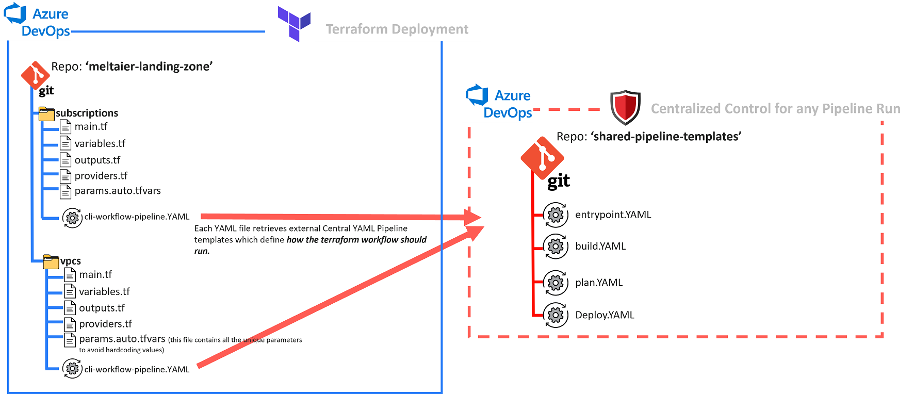
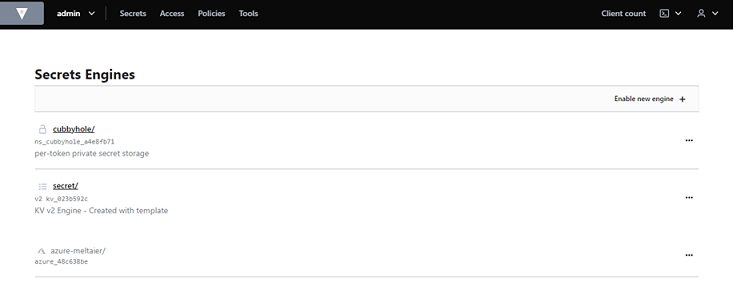

 

 # Version History
Version | Release Date | Release notes | Contributor 
--- | --- | --- | --- |
v0.1 | 03/11/2022 | Initial Release. | Mohamed El taier 
v0.2 | 05/11/2022 | Rebranded and added new diagram. Added HCP Vault config. | Mohamed El taier
v0.3 | 29/11/2022 | Updated readme file & added new diagrams. Public release. | Mohamed El Taier
-----

# Introduction

This repository contains the logic & information to guide you through building custom Azure Cloud Platform Landing Zones.

Azure DevOps (YAML) will be used to orchestrate multi-stage Azure DevOps pipelines which trigger a number of Terraform CLI workflows to run in Terraform Cloud. 
  
The codebase is not based on a single opinionated super terraform module (e.g CAF AzureRM Super Module), it was instead developed in a simpler modular format to simplify the composition of new customized azure cloud landing zones. 

The intention of this repo is to also demonstrate the effectiveness of HCP Vault, Terraform Cloud and Azure DevOps together from an operational, governance & security perspective. The codebase does not require that you deploy the resources all at once, instead you can deploy the resources using the respective YAML file for each resource type folder. It is recommended that you deploy the resources in the following order:
- subscriptions
- management groups
- resourcegroups
- ....then you can deploy other resources accordingly.

# CI-CD Config


# Repo Structure for Terraform and YAML files(Azure DevOps Pipeline).



# Table of Contents
  - [Technology Stack](#technology-stack)
    - [Azure DevOps - CI Tool](#azure-devops---ci-tool)
        - [Azure Devops - Terraform Extension](#azure-devops-terraform-extension)
        - [Azure DevOps - Terraform Variable Group](#azure-devops-terraform-variable-group)
        - [Azure DevOps - Release Control](#azure-devops-release-control)
    - [Terraform Cloud or Terraform Enterprise](#terraform-cloud-or-terraform-enterprise)
    - [Vault Cloud](#vault-cloud)
    - [Azure Cloud Platform](#azure-cloud-platform)
  - [Creating a pipeline](#creating-a-pipeline)
      - [Define the Scope](#define-the-scope)
      - [Setup your terraform workspace](#setup-your-tf-cloud-workspaces)
      - [Set up your terraform and pipeline files](#set-up-your-terraform-and-pipeline-files)
      - [Deploy your pipeline in Azure DevOps Dashboard](#deploy-your-pipeline-in-azure-devops-dashboard)


-----

# Technology Stack
This section covers all the different technologies in use and basic instructions on how to set them up.

Prerequisites:
- **STEP 1:** Go to https://app.terraform.io/ and create a free TF Cloud Account. Then log in to your Tf Cloud Org >> Settings >> API Tokens >> Create a user Token and save it somewhere.

- **STEP 2:** Create an Azure Keyvault in your Azure Sub, and create a secret in it called 'tfcloud-user-token', then copy over the secret value you created from Step 1. 

- **STEP 3:** Create an Azure Subscription to use for 'vending' out the initial set of subscriptions and Management Groups

- **STEP 4:** Create an Azure Service Principal and grant it permissions per the instructions in the following page:
https://developer.hashicorp.com/vault/tutorials/secrets-management/azure-secrets

 Note that if you wish to create other subscriptions using this service principal, you will also need to give it adminstrative permissions to your Azure billing account, as below:


- **STEP 5:** (Optional) If you wish to use dynamic secrets using Vault:
 
 Go to https://www.vaultproject.io/ and create a free account and a free development Vault instance in Azure, this may take 30mins to 1hour. Follow the instructions here https://developer.hashicorp.com/vault/tutorials/cloud/get-started-vault .

 After the Vault instance deployment, go to this section for instruction on how to setup the Vault configuration for Azure https://developer.hashicorp.com/vault/tutorials/secrets-management/azure-secrets

 For the Vault configuration that was used in this repo go to [Vault Cloud](#vault-cloud)

**IMPORTANT NOTE**: Using dynamic secrets to create Azure Subscriptions hasn't been tested. Creating subscriptions using static credentials has only been tested.

## Azure Devops - CI Tool 


You will need to create a new Azure DevOps Org or login into an existing one. You will then need to create a new Project, then fork the below repos:

https://github.com/moho4610/az-hcp-tfc-vault.git

https://github.com/moho4610/az-hcp-tfc-vault-pipelinetemplates.git


### Azure Devops Terraform Extension 
Your Azure DevOps Org will require the installation of 'Azure Pipelines Terraform Tasks' extension.
Click 'Browse Marketplace' and follow the instructions


### Azure Devops Terraform Variable Group
Under Pipelines >> Library >> create a Variable Group in your library called 'az-terra-lab'.

Select 'Link secrets from an Azure Key vault as variables' . Use the drop-down box to select the Azure Sub you used to host your Azure KeyVault, select the KeyVault 'az-terra-lab', click 'Authorize' and follow the prompts then select your secret 'tfcloud-user-token'.

As below:


###  Azure Devops Release Control

Under Pipelines >> Environments >> Create a new Environment 'az-terra-lab'


Click the 3 dots and select 'Approvals and Checks'


Select Approvals and click Next


Add users that are required to approve a pipeline run that is referencing this environment. You will need to invite these users first to your Azure DevOps Org.
You can configure advanced settings to control the number and order in which approvals are required by the users.


###  Azure DevOps YAML Paramaters

Each main pipeline file (CLI-workflow-pipeline.yaml) is configured to accept the upstream parameter 'tfcloudenvironment', as below:


 For the sake of simplicity, the 'tfcloudenvironment' is set as 'az-terra-lab' which is the same value as :

- The Azure DevOps Variable Group (az-terra-lab) which is holding the Tf Cloud user token secret which will be injected into the build agent during runtime.

- The Azure DevOps Environment (az-terra-lab) which has been set with approval gates.

This upstream parameter allows you to set GUI options when running the pipeline manually as below:


#### Param Config
Refer to  the below diagram which depicts the flow of the parameters from the repo holding the terraform code to the repo holding the shared pipeline templates (which are expecting this parameter):


## Terraform Cloud or Terraform Enterprise

**Important Note when creating a TF Cloud/Ent Workspace**: Select 'CLI-driven workflow' when creating a new workspace and ensure it is operating in 'remote' mode. Consider automating the deployment of Terraform Workspace using the official Terraform Cloud Terraform Provider - https://registry.terraform.io/providers/hashicorp/tfe/latest/docs 

Terraform operations will run in TF Cloud and the output will be streamed to the Azure DevOps log output, as below:

### Terraform Cloud - Settings


### Azure DevOps - Pipeline Run Log Output


Ensure the correct TF Cloud Org and Workspace are set in the Provider TF files. 

```
## Method 1 - New (recommended by HashiCorp)
terraform {
  cloud {
    organization = "az-terra-lab"
    #hostname = "" # Optional; defaults to app.terraform.io

    workspaces {
      name = "<<Workspace Name>>"
    }
  }
}

## Method 2 - Old (This type of TF block will be slowly phased out for new TF Cloud deployments)
/*
terraform {
  backend "remote" {
    organization = "az-terra-lab"
    workspaces {
      name = "<<Workspace Name>>"
    }
  }
}
*/
```
For deployments using static secrets, ensure the following variables/env values are set under a variable set and shared with the workspaces where you are deploying your resources. 


If you deploy these variable as 'env' type variables instead of terraform variables , you don't need to reference it in your azurerm provider block, as below:

```
provider "azurerm" {
  features {}

}
```
If you deploy the vars as 'terraform' variable, you will need to reference it in your google provider block, as below:

```
provider "azurerm" {
  features {}

  subscription_id = var.vending_subscription_id
  client_id       = var.adminsvcprincipal_client_id
  client_secret   = var.adminsvcprincipal_client_secret
  tenant_id       = var.adminsvcprincipal_tenant_id
}
```
## Vault Cloud 


HashiCorp Vault Cloud is bieng used in conjunction with Terraform Cloud in the *function-app* terraform deployment see below example:

**EXAMPLE: /function-app/env-config/dev/provider.tf.**
--

```
terraform {
  cloud {
    organization = "az-terra-lab"

    workspaces {
      name = "az-meltaier-function-dev"
    }
  }
}


provider "azurerm" {
  features {}

  subscription_id = var.subscription_id
  client_id       = data.vault_generic_secret.azure_spn.data.client_id
  client_secret   = data.vault_generic_secret.azure_spn.data.client_secret
  tenant_id       = var.tenant_id
}


provider "vault" {}

data "vault_generic_secret" "azure_spn" {
  path = "azure-meltaier/creds/meltaier-root"
}

output "HelloDev" {
  value = "HelloFromDev"
}

```
Notice that neither VAULT_ADDR or VAULT_TOKEN were declared within the provider "vault" block. Both of these values are instead set as environment variables in the respective Terrafrom Cloud Worksapce, in this example it is "az-meltaier-function-dev" workspace in which the environment variables are set using *Terraform Cloud Variable Sets.*

---

The following steps were followed to create a token that can be used by Terraform Cloud:

**1. Login to workstation with Vault Client installed, launch terminal and setup env vars:**

`export VAULT_ADDR=https://vault-public-vault-XXXXXXX.XXXXXXXXXX.z1.hashicorp.cloud:8200`

`export VAULT_TOKEN=<<Insert root token generated from your HCP Vault Token instance >`
`export VAULT_NAMESPACE=admin`

`export ARM_TENANT_ID=<<Insert Azure Tenant ID>>`

`export ARM_CLIENT_ID="Insert Azure APP ID for the Azure service principal"`

`export ARM_CLIENT_SECRET="Insert Azure APP ID for the Azure service principal"`

`export ARM_SUBSCRIPTION_ID="Insert Subscription ID of your Azure 'Subscription Vending' Subscription"`


**2. Enable azure secret engine and mount it to default azure URL**


`vault secrets enable -path=azure-meltaier -description="Dynamic Service Principal Creation in Azure!" -max-lease-ttl=1h -default-lease-ttl=1h azure`



**3. Define the service account (SPN) which will be used by HCP Vault to generate temp creds**

`vault write azure-meltaier/config \tenant_id="${ARM_TENANT_ID}" subscription_id="${ARM_SUBSCRIPTION_ID}" client_id="${ARM_CLIENT_ID}" client_secret="${ARM_CLIENT_SECRET}"`

**4. Specify the role in which you want the temporary token to hold**
```
vault write azure-meltaier/roles/meltaier-root ttl=1h azure_roles=-<<EOF
    [
      {
        "role_name": "Contributor",
        "scope": "/providers/Microsoft.Management/managementGroups/<ID>"
      }
    ]
EOF
```


**5. Test you can generate dynamic secrets**

Run the following Vault command to ensure the secret engine is operational:

`vault read azure-meltaier/creds/meltaier-root`

You should see something like this:


**6. Create a Vault ACL Policy**

In HCP Vault go to Policies>>Create ACL policy and create a similar policy to below
The following policy was named *azure-spn-policy*
```
# Manage secrets engines
path "azure-meltaier/*"
{
  capabilities = ["create", "read", "update", "delete", "list", "sudo"]
}
path "azure-meltaier/"
{
  capabilities = ["read"]
}

# Allow token to create child token
path "auth/token/*" {
  capabilities = ["create", "read", "update", "delete", "list", "sudo"]
}
```


**7. Create an independent(Orphan) token to use for Terraform Cloud deployment**

It is not recommended to authenticate with Vault Provider using HCP root token for TF Cloud Deployment, use a separate token. By default, the HCP root token expires in a few hours anyway.

You will need to create an independent (orphan)token to authenticate to HCP Vault using Terraform Cloud, this token won't expire when your 'root' Vault token expires:

Run the following Vault Command to generate an independent token


`vault token create -period=720h -policy=azure-spn-policy -orphan`


You should see something like this:


**8. Load the independent(Orphan) token to a shared Terraform Cloud Workspace**

Login to your Terraform Cloud Org, add the Vault variables to an existing variable set or create a new shared variable set, as below:


## Azure Cloud Platform
The Azure RM provider is being used, see - https://registry.terraform.io/providers/hashicorp/azurerm/latest/docs for more details.

Refer to Azure's Cloud Adoption Framework for reference designs and best practices:
https://learn.microsoft.com/en-us/azure/cloud-adoption-framework/ready/landing-zone/

### The landing zone in this repository is based on the following landing zone design:

 


-----
 
# Creating a pipeline
This section provides a guide on how to deploy a pipeline for your terraform files.

## Plan the folder structure in your repo
To ensure your environment configuration can scale securely, avoid squeezing all your resources into a single set of terraform files.

Consider using separate terraform modules for each of your resources and use a terraform folder structure that is easy to read and understand for you and your team, as below :

- managementgroups
  - *TF files including param.auto.tfvars file*

- subscriptions
  - *TF files including param.auto.tfvars file*

- resourcegroups
  - applicationname01
    - dev
      - *TF files including param.auto.tfvars file*
    - prd
      - *TF files including param.auto.tfvars file*


## Setup your TF Cloud workspaces

Create a separate workspace for each of the following types of resources in a similar trend to the below:

- **A workspace for each vNet.** 
  - Example: wkspce-az-prd-sharedvnet
- **A workspace for all subnets under a respective vNet**
  - Example: wkspce-az-prd-sharedvnet-subnets
- **A single workspace for all az mgmt groups**
  - Example: wkspce-az-management-groups
- **A workspace for each application (VM or Container) per deployment environment (dev/uat/prod)**
  - Example: wkspce-az-app01-dev, wkspce-az-app01-uat, wkspce-az-app01-prod


## Set up your terraform and pipeline files

Create a terraform folder in your repo for the resources you wish to deploy and ensure the following files are placed inside:

### **cli-workflow-pipeline.yaml**
Ensure 'tflocation' is defined as the terraform folder holding your resource definitions. See [Param Config](#param-config)

### **Example file: meltaier-landing-zone\mgmtgroups\cli-workflow-pipeline.yaml**
```
name: pipeline-az-meltaier-landing-zone-mgmtgroups

## In this parameter block we are asking the user to define an Azure Devops Environment if the build is to be triggered manually. Default is set to env_dev
parameters:
  - name: tfcloudenvironment
    displayName: Choose from the below available Terraform Cloud Environments
    type: string
    default: az-terra-lab
    values:
    - az-terra-lab

trigger:
  batch: false
  branches:
    include:
      - main
  paths:
    include:
      - '/mgmtgroups/*'


## Declare external repo which holds pipeline template files
resources:
  repositories:
    - repository: shared-pipelines
      name: shared-pipeline-templates      ## Reference the name of repository which holds your pipeline YAML files.
      type: git
      ref: main


variables:
- template: pipeline-globalvars.yaml@shared-pipelines
- group: ${{ parameters.tfcloudenvironment }} # Must enter your Azure Devops Variable Group here that contains your TFC Team API Key

stages:
##---------------------------------------------##
## Route to main pipeline templates           ##
##---------------------------------------------##
  
  - template: entrypoint.yaml@shared-pipelines
    parameters: 
      tflocation: mgmtgroups
      environment: ${{ parameters.tfcloudenvironment }}

 
```

**cli-workflow-pipeline.yaml** is the 'head' pipeline file which points to the main downstream pipeline template files which get triggered in the following order:

1. entrypoint.yaml - This YAML file defines all the YAML stages, each stage is executed through the YAML files below (2, 3 and 4).
2. build.yaml - This YAML contains formatting and validation steps
3. plan.yaml - This YAML contains plan steps
4. deploy.yaml - This YAML contains apply steps

This design ensures there is a centralised process for deploying and augmenting terraform resources. All the downstream pipeline templates are kept here - https://dev.azure.com/arq-poc-meltaier/az-terra-landingzone/_git/shared-pipeline-templates

### **<Terraform_Resource_Definition_Files>.tf**
This file should contain the definitions of all the resources you wish to deploy.
To reference existing resources, for example referencing existing subscriptions created by Terraform. It is recommended you pull the reference from the existing terraform workspace's state file. See example below

### **Example file:\meltaier-landing-zone\mgmtgroups\main.tf**
```
data "terraform_remote_state" "query_subscriptions" {
  backend = "remote"
  config = {
    organization = "az-terra-lab"
    workspaces = {
      name = "az-meltaier-landing-zone-subscriptions"
    }
  }
}


##### Top Level Management Group

resource "azurerm_management_group" "topLevel_AzureOrg" {
  display_name = var.topLevel_mgmtGroupName1
}

data "azurerm_management_group" "topLevel_AzureOrg" {
  display_name = azurerm_management_group.topLevel_AzureOrg.display_name
}

resource "azurerm_role_assignment" "globalAdminGroupRoleAssignemnt_topLevel_AzureOrg" {
  scope                = azurerm_management_group.topLevel_AzureOrg.id
  role_definition_name = "Owner"
  principal_id         = var.AADglobalAdminGroupObjectid
}

output "topLevel_AzureOrg" {
  value = azurerm_management_group.topLevel_AzureOrg
}

...................
................
..............


#############################################################
resource "azurerm_management_group" "level2_mgmtgroup4" {
  display_name               = var.level2_mgmtGroupName4
  parent_management_group_id = azurerm_management_group.topLevel_AzureOrg.id
  subscription_ids = [
    data.terraform_remote_state.query_subscriptions.outputs.subscriptionSandbox1.subscription_id
  ]
}

output "level2_mgmtgroup4" {
  value = azurerm_management_group.level2_mgmtgroup4
}
##############################################################

.....
................
.........................
```

### **variables.tf**
This file holds all the declarations of all terraform inputs for your resource definitons.

### **provider.tf**
This file holds all the definitions of the backend terraform provider (Cloud\Enterprise) & the backend cloud provider (Azure). Ensure the workspace name is set correctly and exists in TF cloud. 
### **Example file: meltaier-landing-zone\mgmtgroups\provider.tf**
```
terraform {
  cloud {
    organization = "az-terra-lab"
    #hostname = "" # Optional; defaults to app.terraform.io

    workspaces {
      name = "az-meltaier-landing-zone-mgmtgroups"
    }
  }
}

provider "azurerm" {
  features {}

  subscription_id = var.vending_subscription_id
  client_id       = var.adminsvcprincipal_client_id
  client_secret   = var.adminsvcprincipal_client_secret
  tenant_id       = var.adminsvcprincipal_tenant_id
}

```

### **outputs.tf**
This file holds all the definitions of all outputs the terraform apply operations will release after an apply operation. If you expect to reference the resource you are deploying, ensure you output the configuration so the resource can be referenced from its statefile in TF Cloud.


### **params.auto.tfvars**
This file should hold all the values of the terraform variables. During runtime terraform automatically loads the values defined in this file. Ensure compulsory tags are defined in the file and do not have any upper-case letters.
### **Example file: meltaier-landing-zone\mgmtgroups\params.auto.tfvars**

```

AADglobalAdminGroupObjectid = "6c12b2bb-0d68-4452-8b4d-48931e7b05c3"

topLevel_mgmtGroupName1 = "Meltaier Azure Org"

level2_mgmtGroupName1 = "Platform"
level2_mgmtGroupName2 = "Applications"
level2_mgmtGroupName3 = "Decomissioned"
level2_mgmtGroupName4 = "Sandbox"

level3_mgmtGroupName1 = "Identity"
level3_mgmtGroupName2 = "Management"
level3_mgmtGroupName3 = "Connectivity"
level3_mgmtGroupName4 = "SAP"
level3_mgmtGroupName5 = "Corporate"


```


-----

## Deploy your pipeline in Azure DevOps Dashboard

When deploying your pipelines in Azure DevOps, select 'Existing Azure Pipelines YAML file' and enter the path of the main YAML pipeline file.


